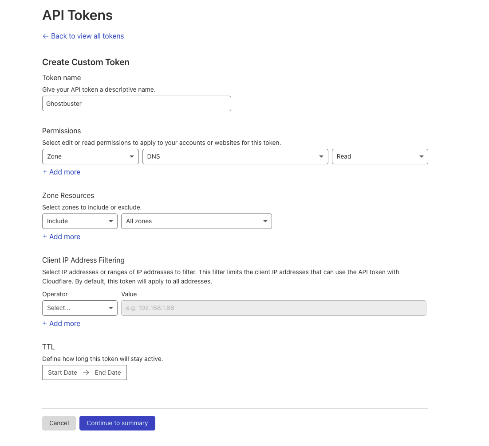

# Table of Contents
- [Table of Contents](#table-of-contents)
- [Ghostbuster](#ghostbuster)
  - [The problem](#the-problem)
  - [Project Features](#project-features)
  - [Installing Ghostbuster](#installing-ghostbuster)
  - [Using Ghostbuster](#using-ghostbuster)
  - [Example Output](#example-output)
  - [Setting up your AWS accounts](#setting-up-your-aws-accounts)
  - [Setting up Cloudflare (Optional)](#setting-up-cloudflare-optional)
  - [Authors](#authors)
  - [License](#license)

# Ghostbuster

Eliminate dangling elastic IPs by performing analysis on your resources within all your AWS accounts.

Ghostbuster obtains all the DNS records present in all of your AWS accounts (Route53), and can optionally take in records via CSV input, or via Cloudflare. 

After these records are collected, Ghostbuster iterates through all of your AWS Elastic IPs and Network Interface Public IPs and collects this data.

By having a complete picture of the DNS records (from route53, file input or cloudflare) and having a complete picture of the AWS IPs owned by your organization, this tool can detect subdomains that are pointing to dangling elastic IPs (IPs you no longer own).

## The problem

When you are deploying infrastructure to AWS, you may spin up EC2 instances which have an IP associated with them. When you create DNS records pointing to these IPs, but forget to remove the DNS records after the EC2 instance has been given a new IP or destroyed, you are susceptible to subdomain takeover attacks.

There has been a great amount of research done on elastic IP takeovers, where it is possible for attackers to continually claim elastic IPs until they obtain an IP associated with a subdomain of the company they are targeting.

While AWS frequently bans accounts that are attempting to perform this attack pattern, no long term fix has been released by AWS. As a result, AWS customers have been and are still vulnerable to subdomain takeover attacks through dangling elastic IPs.

## Project Features

* Dynamically iterates through each AWS profile configured in `.aws/config`
* Pulls A records from AWS Route53
* Pulls A records from Cloudflare (optional)
* Pulls A records from CSV input (optional)
* Iterate through all regions, a single region, or a comma delimitted list of regions
* Obtains all Elastic IPs associated with all of your AWS accounts
* Obtains all Public IPs associated with all of your AWS accounts
* Cross checks the DNS records, with IPs owned by your organization to detect potential takeovers
* Slack Webhook support to send notifications of takeovers

**Important:**

In order for this tool to be effective, it must have a complete picture of your AWS environment. If it does not have a complete picture, it will lead to false positive findings.

## Installing Ghostbuster

Installing Ghostbuster is as simple as running: `pip install ghostbuster`. The CLI tool will then be accessible via the `ghostbuster` command.

This requires a Python 3.x environment.

## Using Ghostbuster

```
❯ ghostbuster scan aws --help     
Usage: ghostbuster scan aws [OPTIONS]

  Scan for dangling elastic IPs inside your AWS accounts.

Options:
  --skipascii             Skip printing the ASCII art when starting up
                          Ghostbuster.

  --slackwebhook TEXT     Specify a Slack webhook URL to send notifications
                          about potential takeovers.

  --records PATH          Manually specify DNS records to check against.
                          Ghostbuster will check these IPs after checking
                          retrieved DNS records. See records.csv for an
                          example.

  --cloudflaretoken TEXT  Pull DNS records from Cloudflare, provide a CF API
                          token.

  --allregions            Run on all regions.
  --exclude TEXT          Comma delimited list of profile names to exclude.
  --regions TEXT          Comma delimited list of regions to run on.
  --help                  Show this message and exit.
```

**Example Commands**

Run Ghostbuster with access to Cloudflare DNS records, send notifications to a Slack webhook, iterate through every AWS profile configured in `.aws/config or .aws/credentials` for all AWS regions

```
❯ ghostbuster scan aws --cloudflaretoken APIKEY --slackwebhook https://hooks.slack.com/services/KEY --allregions
```

Run Ghostbuster with a manually input list of subdomain A records (see `records.csv` in this repo for example file):

```
❯ ghostbuster scan aws --records records.csv
```

You can specify specific regions using `--regions` set to a comma delimited list of regions i.e. `us-east-1,us-west-1`.

## Example Output

```
❯ ghostbuster scan aws --cloudflaretoken whougonnacall
Obtaining all zone names from Cloudflare.
Obtaining DNS A records for all zones from Cloudflare.
Obtained 33 DNS A records so far.
Obtaining Route53 hosted zones for AWS profile: default.
Obtaining Route53 hosted zones for AWS profile: account-five.
Obtaining Route53 hosted zones for AWS profile: account-four.
Obtaining Route53 hosted zones for AWS profile: account-four-deploy.
Obtaining Route53 hosted zones for AWS profile: account-two-deploy.
Obtaining Route53 hosted zones for AWS profile: account-one-deploy.
Obtaining Route53 hosted zones for AWS profile: account-three-deploy.
Obtaining Route53 hosted zones for AWS profile: account-six.
Obtaining Route53 hosted zones for AWS profile: account-seven.
Obtaining Route53 hosted zones for AWS profile: account-one.
Obtained 124 DNS A records so far.
Obtaining EIPs for region: us-east-1, profile: default
Obtaining IPs for network interfaces for region: us-east-1, profile: default
Obtaining EIPs for region: us-east-1, profile: account-five
Obtaining IPs for network interfaces for region: us-east-1, profile: account-five
Obtaining EIPs for region: us-east-1, profile: account-four
Obtaining IPs for network interfaces for region: us-east-1, profile: account-four
Obtaining EIPs for region: us-east-1, profile: account-four-deploy
Obtaining IPs for network interfaces for region: us-east-1, profile: account-four-deploy
Obtaining EIPs for region: us-east-1, profile: account-two-deploy
Obtaining IPs for network interfaces for region: us-east-1, profile: account-two-deploy
Obtaining EIPs for region: us-east-1, profile: account-one-deploy
Obtaining IPs for network interfaces for region: us-east-1, profile: account-one-deploy
Obtaining EIPs for region: us-east-1, profile: account-three-deploy
Obtaining IPs for network interfaces for region: us-east-1, profile: account-three-deploy
Obtaining EIPs for region: us-east-1, profile: account-six
Obtaining IPs for network interfaces for region: us-east-1, profile: account-six
Obtaining EIPs for region: us-east-1, profile: account-seven
Obtaining IPs for network interfaces for region: us-east-1, profile: account-seven
Obtaining EIPs for region: us-east-1, profile: account-one
Obtaining IPs for network interfaces for region: us-east-1, profile: account-one
Obtained 415 unique elastic IPs from AWS.


Takeover possible: {'name': 'takeover.assetnotecloud.com', 'records': ['52.54.24.193']}
```

## Setting up your AWS accounts

The first step is creating keys or roles in your AWS accounts that grant the privileges necessary to read Route53 records and describe elastic addresses and EC2 network interfaces.

1. To create a new IAM user in AWS, visit the following URL: https://console.aws.amazon.com/iam/home#/users$new?step=details
2. Choose `Access key - Programmatic access` only, and click `Next: Permissions`.
3. Click `Attach existing policies directly` and then click `Create policy`.
4. Click `JSON` and then paste in the following policy:

```
{
    "Version": "2012-10-17",
    "Statement": [
        {
            "Sid": "GhostbusterPolicy",
            "Effect": "Allow",
            "Action": [
                "ec2:DescribeAddresses",
                "ec2:DescribeNetworkInterfaces",
                "route53:ListResourceRecordSets",
                "route53:ListHostedZonesByName",
                "route53:GetTrafficPolicyInstance",
                "route53:GetTrafficPolicy"
            ],
            "Resource": "*"
        }
    ]
}
```

5. Click `Next: Tags` and then `Next: Review`.
6. Set the name of the policy to be `GhostbusterPolicy`.
7. Click `Create Policy`.
8. Go to https://console.aws.amazon.com/iam/home#/users$new?step=permissions&accessKey&userNames=ghostbuster&permissionType=policies
9. Select `GhostbusterPolicy`.
10. Click `Next: Tags` and then `Next: Review`.
11. Click on `Create user` and setup the AWS credentials in your `.aws/credentials` file.

Repeat the above steps for each AWS account you own.

This tool will work with however you've setup your AWS configuration (multiple keys, or cross-account assume role profiles). This is managed by boto3, the library used to interface with AWS.

An example configuration looks like this:

`.aws/credentials`:

```
[default]
aws_access_key_id = AKIAIII...
aws_secret_access_key = faAaAaA...
```

`.aws/config`:

```
[default]
output = table
region = us-east-1

[profile account-one]
role_arn = arn:aws:iam::911111111113:role/Ec2Route53Access
source_profile = default
region = us-east-1

[profile account-two]
role_arn = arn:aws:iam::911111111112:role/Ec2Route53Access
source_profile = default
region = us-east-1

[profile account-three]
region = us-east-1
role_arn = arn:aws:iam::911111111111:role/Ec2Route53Access
source_profile = default
```

Alternatively, instead of having roles which are assumed, you can also configure the `.aws/credentials` file to have a list of profiles and assocaited keys with scoped access.

Once your AWS configuration has been set with all the accounts in your AWS environment, you can then run the tool using the following command:

## Setting up Cloudflare (Optional)

If you want Ghostbuster to pull in all the A records that you have set in Cloudflare, you will have to setup an API token that can read zones.

https://dash.cloudflare.com/profile/api-tokens

Setup a Cloudflare API token like shown in the screenshot below:



Once you have obtained this API token, make a note of it somewhere (password manager). In order to use it with Ghostbuster, pass it in via the `cloudflaretoken` argument.

## Authors

* **Shubham Shah** - *Initial work* - [github](https://github.com/infosec-au)

See also the list of [contributors](https://github.com/assetnote/ghostbuster/contributors) who participated in this project.

## License

GNU Affero General Public License